# 校园二手交易平台数据库系统

## 在线访问网址

**https://campus-secondhand-db.vercel.app**

GitHub 仓库：**https://github.com/xzllll-ai/campus-secondhand-db**

---

## 一、从运行代码到获得最终网址的具体步骤

### 1.1 本地运行

```bash
# 克隆项目到本地
git clone <仓库地址>
cd shujvku

# 启动本地开发服务器
npm run dev

# 浏览器打开 http://localhost:3000 即可预览
```

### 1.2 推送代码到 GitHub

```bash
# 初始化本地仓库（如果还没有 .git）
git init

# 添加所有文件到暂存区
git add .

# 提交
git commit -m "初始化项目：校园二手交易平台数据库系统"

# 在 GitHub 上新建一个仓库（例如 campus-secondhand-db），不要勾选 README/gitignore 等选项
# 然后关联远程仓库并推送：
git remote add origin https://github.com/<你的用户名>/campus-secondhand-db.git
git branch -M main
git push -u origin main
```

后续修改代码后，提交并推送更新：

```bash
git add .
git commit -m "描述你的修改内容"
git push
```

### 1.3 部署到 Vercel 获取在线网址

**方式一：通过 Vercel 网页部署（推荐）**

1. 打开 https://vercel.com ，用 GitHub 账号登录
2. 点击 "Add New Project" → "Import Git Repository"
3. 选择刚才推送的 `campus-secondhand-db` 仓库
4. 配置如下：
   - Framework Preset：**Other**
   - Build Command：`npm run build`
   - Output Directory：`public`
5. 点击 **Deploy**，等待部署完成
6. 部署成功后会得到一个网址，例如 `https://campus-secondhand-db.vercel.app`

**方式二：通过命令行部署**

```bash
# 安装 Vercel CLI
npm i -g vercel

# 登录（会跳转浏览器授权）
vercel login

# 在项目根目录执行部署
vercel

# 按提示选择：
#   Set up and deploy? → Y
#   Which scope? → 个人账号
#   Link to existing project? → N
#   Project name? → campus-secondhand-db
#   Directory? → ./

# 部署完成后获得网址，例如：
# ✅ Production: https://campus-secondhand-db.vercel.app
```

**后续更新流程：**

```bash
# 1. 修改代码后，先推送到 GitHub
git add .
git commit -m "修改说明"
git push

# 2. 如果用网页部署：Vercel 会自动检测 GitHub 更新并重新部署（自动）
#    如果用命令行部署：需要手动执行
vercel --prod
```

> `vercel.json` 中配置了 `"outputDirectory": "public"`，Vercel 直接托管 `public/` 目录作为静态网站，无需 Node.js 运行环境。

---

## 二、全部网页截图与任务运行结果

### 2.1 首页

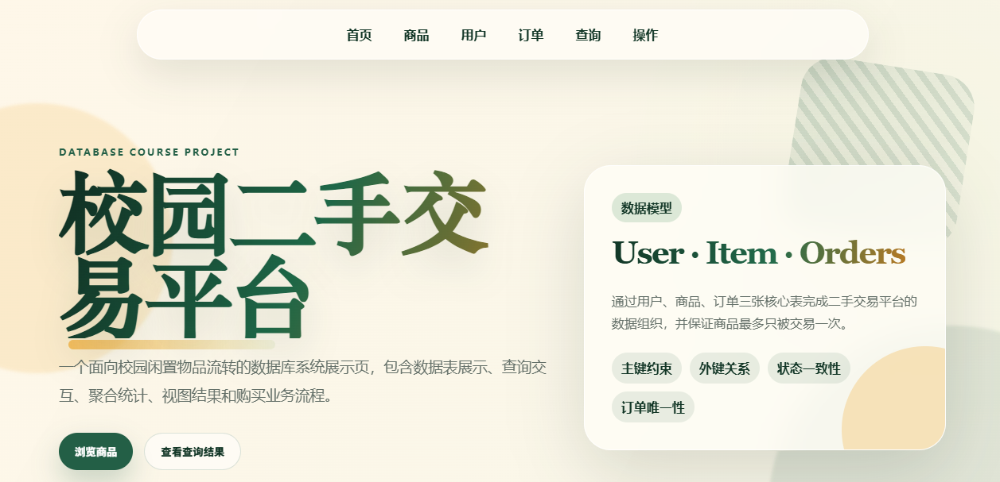

页面顶部展示项目标题"校园二手交易平台"、数据模型说明卡片（User · Item · Orders），以及导航栏和快捷按钮。

---

### 2.2 数据库表展示

#### 用户表（User）

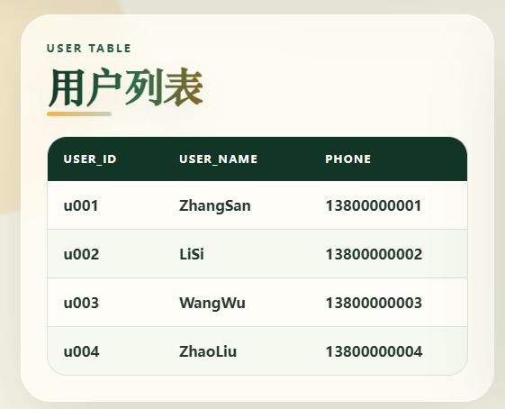

展示 4 条用户记录，包含 user_id、user_name、phone 三个字段。支持点击表头排序，点击行弹出详情。

#### 商品表（Item）

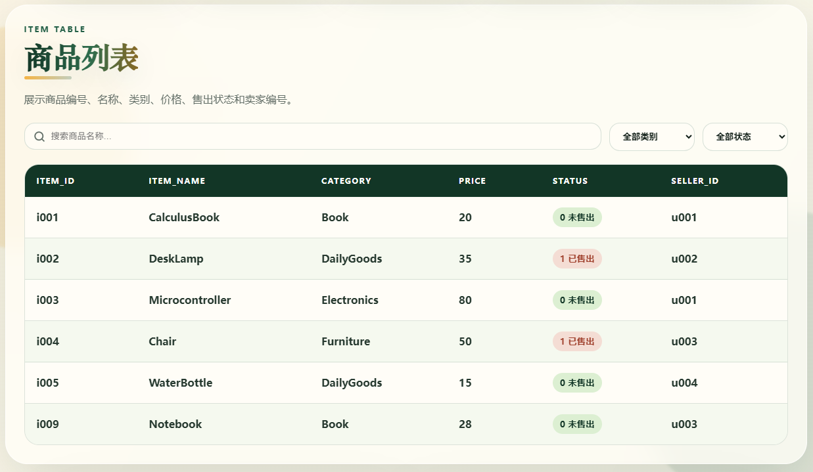

展示 5 条商品记录，包含商品编号、名称、类别、价格、售出状态、卖家编号。支持搜索框按名称筛选、下拉按类别/状态筛选、表头排序、行详情。

#### 订单表（Orders）

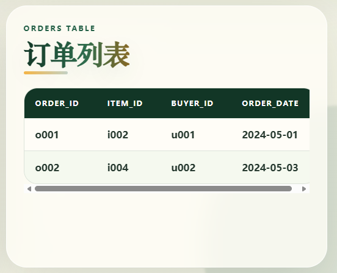

展示 2 条订单记录，包含 order_id、item_id、buyer_id、order_date。支持排序和行详情。

---

### 2.3 基本查询结果

#### 查询 1：所有未售出的商品

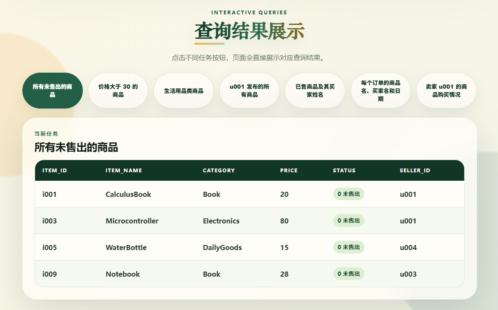

SQL：`SELECT * FROM item WHERE status = 0`

结果：返回 status=0 的商品，即 CalculusBook、Microcontroller、WaterBottle。

#### 查询 2：价格大于 30 的商品

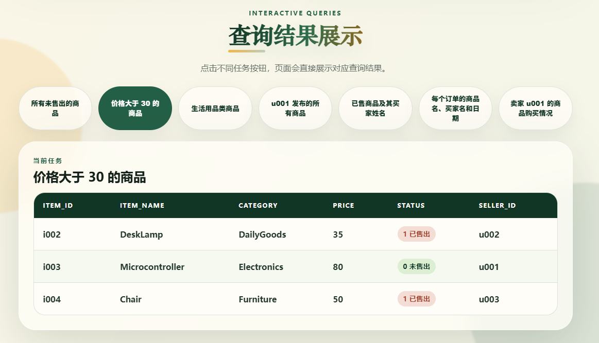

SQL：`SELECT * FROM item WHERE price > 30`

结果：返回 DeskLamp(35)、Microcontroller(80)、Chair(50)。

#### 查询 3：生活用品类商品

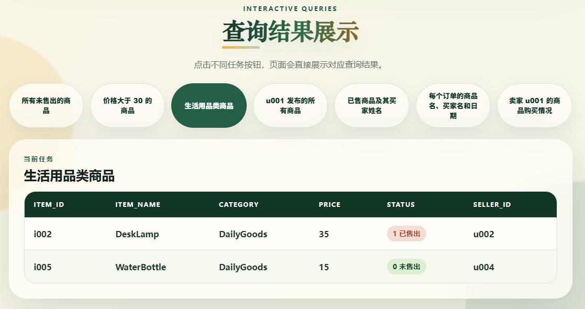

SQL：`SELECT * FROM item WHERE category = 'DailyGoods'`

结果：返回 DeskLamp、WaterBottle。

#### 查询 4：u001 发布的所有商品

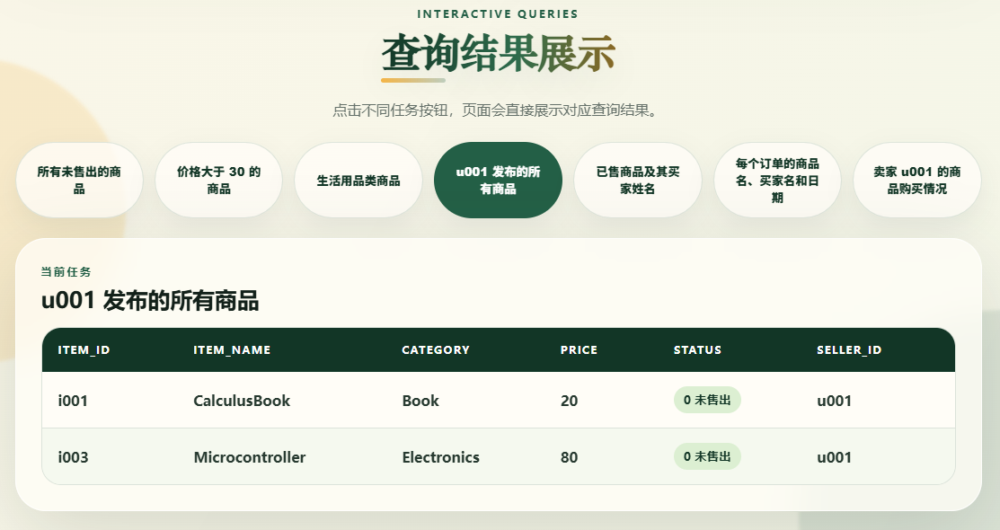

SQL：`SELECT * FROM item WHERE seller_id = 'u001'`

结果：返回 CalculusBook、Microcontroller。

---

### 2.4 连接查询结果

#### 查询 5：已售商品及其买家姓名

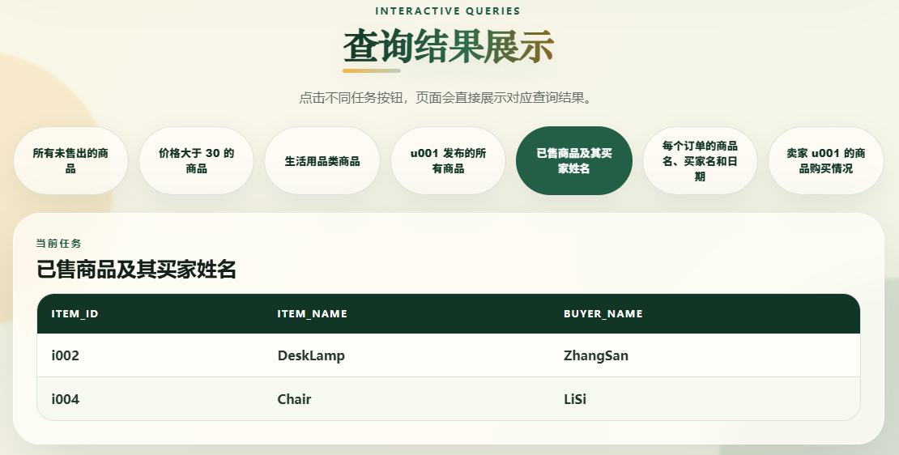

SQL：`SELECT item.item_id, item.item_name, user.user_name AS buyer_name FROM item JOIN orders ON item.item_id = orders.item_id JOIN user ON orders.buyer_id = user.user_id WHERE item.status = 1`

结果：返回已售商品 DeskLamp(买家 ZhangSan)、Chair(买家 LiSi)。

#### 查询 6：每个订单的商品名、买家名和日期

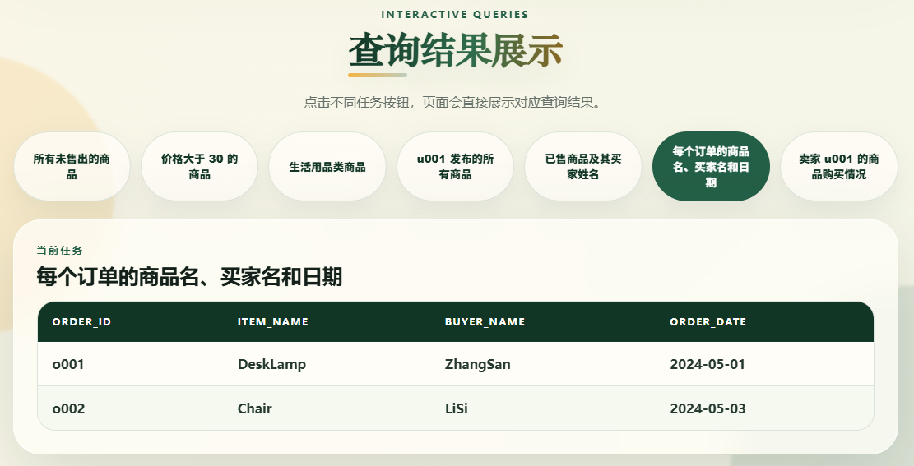

SQL：`SELECT orders.order_id, item.item_name, user.user_name AS buyer_name, orders.order_date FROM orders JOIN item ON orders.item_id = item.item_id JOIN user ON orders.buyer_id = user.user_id`

结果：返回 o001(DeskLamp, ZhangSan, 2024-05-01)、o002(Chair, LiSi, 2024-05-03)。

#### 查询 7：u001 商品购买情况

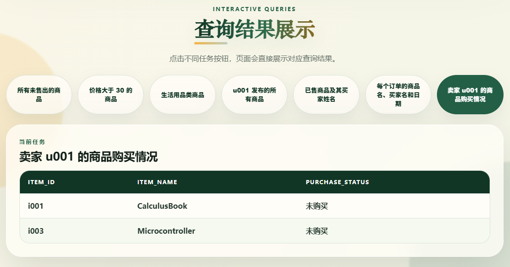

SQL：`SELECT item.item_id, item.item_name, CASE WHEN orders.order_id IS NULL THEN '未购买' ELSE '已购买' END FROM item LEFT JOIN orders ON item.item_id = orders.item_id WHERE item.seller_id = 'u001'`

结果：CalculusBook(未购买)、Microcontroller(未购买)。

---

### 2.5 聚合查询结果

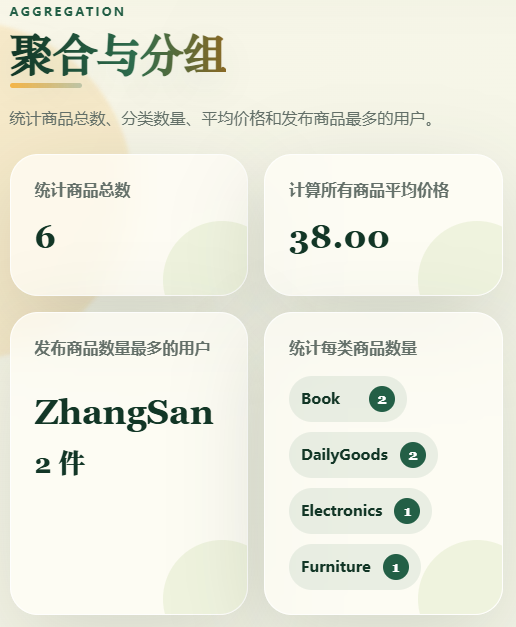

- **商品总数：** `SELECT COUNT(*) FROM item` → 5
- **平均价格：** `SELECT AVG(price) FROM item` → 40.00
- **发布最多商品的用户：** `SELECT ... COUNT(*) ... GROUP BY ... ORDER BY DESC LIMIT 1` → ZhangSan(2件)
- **每类商品数量：** `SELECT category, COUNT(*) FROM item GROUP BY category` → Book:1, DailyGoods:2, Electronics:1, Furniture:1

右下方饼图展示各类别占比。

---

### 2.6 视图结果

#### 已售商品视图

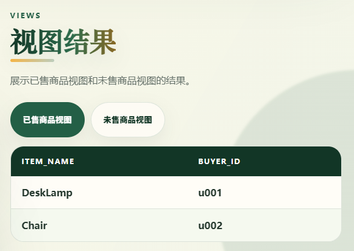

SQL：`CREATE VIEW sold_item_view AS SELECT item.item_name, orders.buyer_id FROM item JOIN orders ON item.item_id = orders.item_id WHERE item.status = 1`

#### 未售商品视图

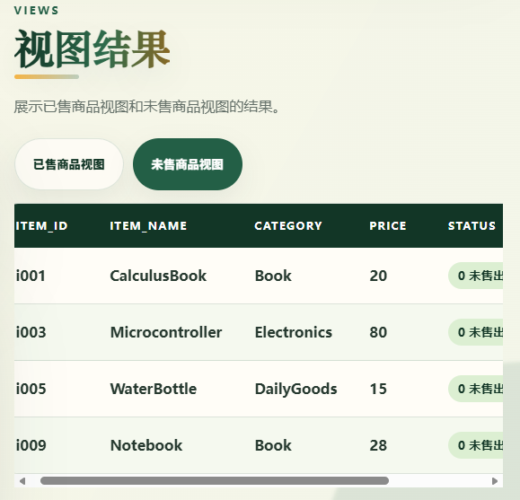

SQL：`CREATE VIEW unsold_item_view AS SELECT * FROM item WHERE status = 0`

---

### 2.7 数据修改操作

#### 插入新商品

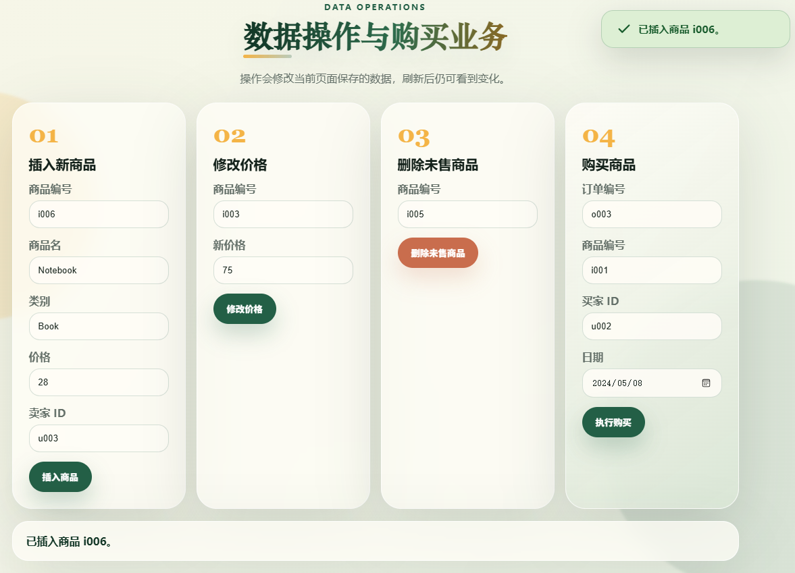

SQL：`INSERT INTO item VALUES ('i006', 'Notebook', 'Book', 28, 0, 'u003')`

操作：填写表单 01，点击"插入商品"，商品表新增一条记录。

#### 修改价格

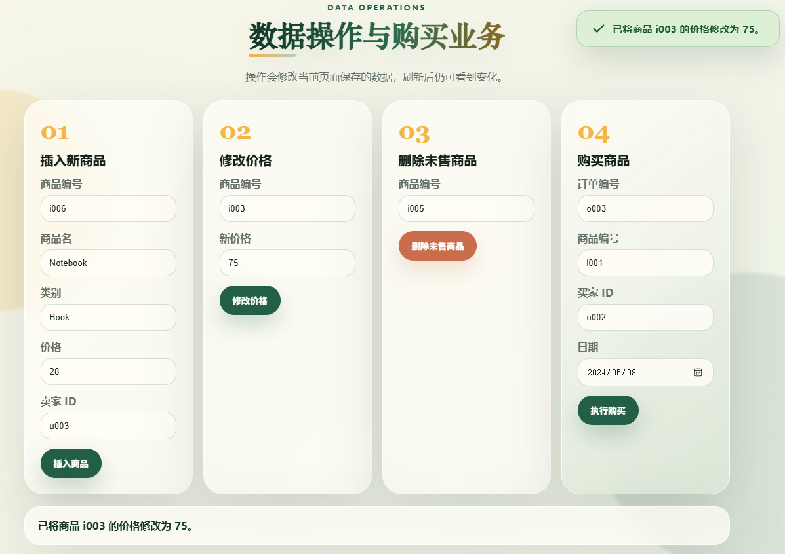

SQL：`UPDATE item SET price = 75 WHERE item_id = 'i003'`

操作：填写表单 02，点击"修改价格"，Microcontroller 价格从 80 变为 75。

#### 删除未售商品

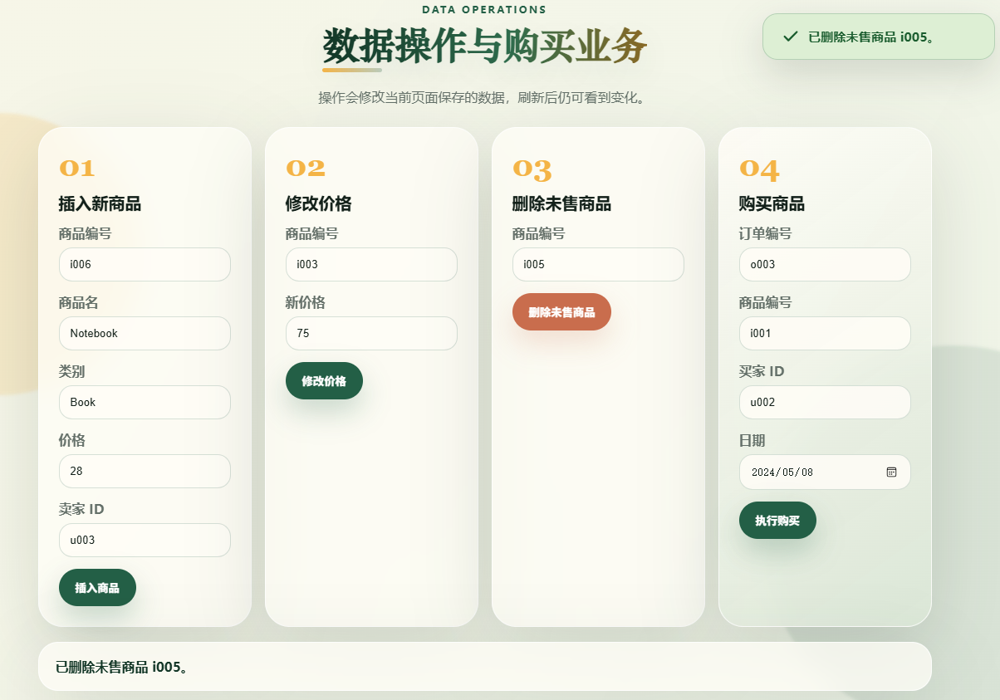

SQL：`DELETE FROM item WHERE item_id = 'i005' AND status = 0 AND item_id NOT IN (SELECT item_id FROM orders)`

操作：填写表单 03，点击"删除未售商品"，弹出确认对话框后 WaterBottle 被删除。

---

### 2.8 购买商品业务

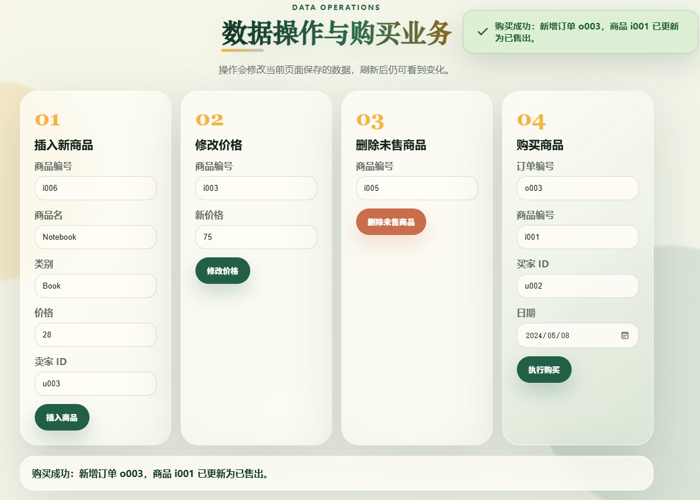

SQL（事务）：

```sql
START TRANSACTION;
SELECT status FROM item WHERE item_id = 'i001' FOR UPDATE;
INSERT INTO orders (order_id, item_id, buyer_id, order_date)
SELECT 'o003', 'i001', 'u002', '2024-05-08'
FROM item WHERE item_id = 'i001' AND status = 0
  AND NOT EXISTS (SELECT 1 FROM orders WHERE item_id = 'i001');
UPDATE item SET status = 1 WHERE item_id = 'i001' AND status = 0
  AND EXISTS (SELECT 1 FROM orders WHERE order_id = 'o003');
COMMIT;
```

操作：填写表单 04（订单 o003、商品 i001、买家 u002、日期 2024-05-08），弹出确认后执行购买。CalculusBook 状态从"未售出"变为"已售出"，订单表新增一条记录。

---

### 2.9 数据变化趋势图

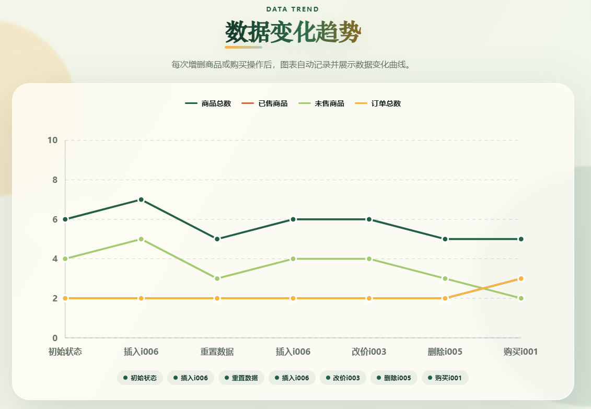

每次执行插入、删除、修改价格、购买操作后，折线图自动记录数据快照，展示商品总数、已售商品、未售商品、订单总数 4 条曲线的变化趋势。鼠标悬停可查看具体数值。

---

## 三、简答

### 安全性说明

**问：系统采取了哪些措施保障数据安全？**

**答：**

1. **权限分离：** 系统采用前后端分离架构，前端页面仅提供数据展示和交互入口。普通用户（访客）只能查看数据，不具备删除、修改等写权限；数据修改操作（INSERT、UPDATE、DELETE）由管理员通过操作表单执行。本项目通过页面分区（查询区 vs 操作区）直观展示了权限分离的设计。

2. **输入校验：** 所有表单输入均使用 HTML5 `required` 属性进行非空校验，数值类型使用 `type="number" min="1"` 限制取值范围。前端 JavaScript 对每个操作进行业务逻辑校验（商品是否存在、卖家是否存在、商品是否已售出等），防止非法数据写入。

3. **参数化访问防 SQL 注入：** 对应到真实数据库场景，后端应使用参数化查询（Prepared Statements）将用户输入作为参数传递，而非拼接 SQL 字符串，从根本上防止 SQL 注入攻击。

4. **登录鉴权与角色权限：** 实际生产环境中应实现 JWT Token 或 Session 登录鉴权，通过 RBAC（基于角色的访问控制）区分普通用户和管理员，普通用户仅开放查询权限。

5. **数据库完整性约束：** 通过 PRIMARY KEY、FOREIGN KEY、NOT NULL、CHECK、UNIQUE 等约束从数据库层面保证数据的实体完整性、参照完整性和用户自定义完整性，防止非法数据进入数据库。

---

### 并发与恢复说明

**问：如何处理并发购买和系统崩溃恢复？**

**答：**

#### 并发控制

**问题：** 两个用户同时购买同一商品，可能产生重复订单或商品状态不一致。

**解决方案：**

1. **事务（Transaction）：** 将"新增订单 + 更新商品状态"封装在一个事务中（`START TRANSACTION ... COMMIT`），保证两个操作要么同时成功，要么同时回滚，不会出现中间状态。

2. **行级锁（FOR UPDATE）：** 在事务开始时使用 `SELECT status FROM item WHERE item_id = ? FOR UPDATE` 对目标商品行加排他锁。其他并发事务必须等待当前事务提交或回滚后才能操作同一商品，避免并发冲突。

3. **唯一约束（UNIQUE）：** 为 `orders.item_id` 设置 UNIQUE 约束。即使并发事务绕过了应用层校验，数据库层面也会拒绝重复的商品订单，保证一个商品最多只被购买一次。

4. **条件插入：** 使用 `INSERT INTO ... SELECT ... WHERE NOT EXISTS (SELECT 1 FROM orders WHERE item_id = ?)` 确保只有在商品确实没有被购买过时才插入订单。

#### 系统崩溃恢复

1. **事务日志（WAL）：** 数据库的 Write-Ahead Logging 机制保证系统崩溃时，已提交的事务可通过日志重做（Redo），未提交的事务可回滚（Undo），数据不会出现不一致。

2. **备份恢复：** 定期进行全量备份和增量备份，崩溃后可从最近备份点恢复数据，再通过事务日志重放到崩溃前的状态。

3. **前端数据持久化：** 本项目使用浏览器 localStorage 模拟数据持久化，刷新页面后数据仍保留。对应到真实场景，数据库的数据文件和日志文件存储在磁盘上，系统重启后自动恢复。
